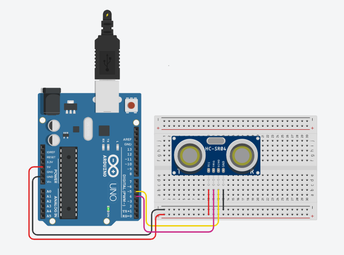

# Medindo a distância
 Neste experimento será realizado a leitura de um sensor ultrassônico e armazenado em uma variável, depois esta variável será impressa no monitor serial. O sensor ultrassônico será conectado à porta digital 4 para o acionador (trigger) e a porta digital 5 para echo. Sensores ultrassônicos usam o mesmo princípio que os morcegos (mamíferos voadores) usam para detectar obstáculos - enviando sinais ultrassônicos e analisando a reflexão/eco.  

 <b><a href="https://www.tinkercad.com/things/06vicrJQAhC">Clique Aqui</a></b> para ver o projeto em Tinkercard.com!
 
## Lista de componentes:

- 1  Arduíno UNO R3
- 1  Um cabo de conexão USB
- 1  Placa de prototipação (Protoboard)
- 1  Sensor ultrassônico HC-SR04 
- 6  Jumpers (macho-macho)

## Esquema do projeto

